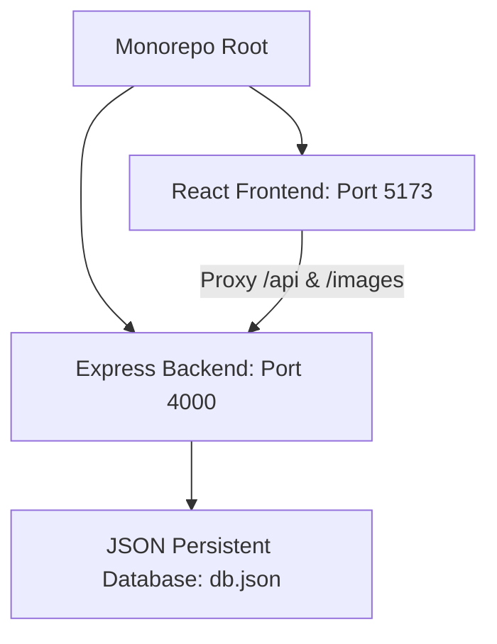

# Operating Guide: Running the "Joel." Full-Stack Application

This guide provides detailed, structured instructions for installing, configuring, running, and maintaining the **"Joel." Artisan Food Delivery System**.

---

## 📌 Architecture Overview

"Joel." is designed with a modern monorepo structure consisting of three core parts:



1. **Monorepo Root Router**: Orchestrates simultaneous package management and background servers execution via `concurrently`.
2. **React Frontend (`/frontend`)**: Serves the user interface and admin dashboard. Powered by **Vite**, **Tailwind CSS**, and **Lucide Icons**, it routes requests through `react-router-dom` and forwards backend traffic through a local development reverse proxy.
3. **Express Backend (`/backend`)**: Handles business logic, authentication tokens (JWT), Multer-based image storage, and serves the database API.
4. **JSON Database (`/backend/data/db.json`)**: A reliable, low-overhead file system database. It utilizes synchronous reading/writing hooks to guarantee full transactional consistency without external server instances.

---

## 🛠️ Prerequisites

Before launching the application, ensure your environment meets the following conditions:

* **Node.js**: Version `16.x` or higher (Recommended: `18.x` or `20.x` LTS).
* **npm**: Version `8.x` or higher (packaged automatically with Node.js).
* **Terminal Shell**: PowerShell or Command Prompt (Windows), or Bash/Zsh (Linux/macOS).

---

## ⚡ Option 1: The Quick Start (Recommended)

The monorepo contains pre-configured scripts to automate dependency installs and boot both services simultaneously.

### Step 1: Install All Dependencies
Open your terminal in the root `joel-app` folder and run:
```bash
npm run install-all
```
*Behind the scenes, this executes a script that runs `npm install` inside the root, `/backend`, and `/frontend` directories sequentially.*

### Step 2: Start Both Servers
Launch frontend and backend concurrently:
```bash
npm run dev
```
Once executed, the terminal will multiplex the output logs of both systems. You can open your web browser and navigate to:
* **Frontend Application**: [http://localhost:5173](http://localhost:5173)
* **Backend API Base**: [http://localhost:4000](http://localhost:4000)

---

## 🔍 Option 2: Running Systems Individually

For debugging or targeted development, you may want to start the database API server and the user interface separately.

### A. The Database & Backend Engine (`/backend`)

The Express server controls all application data operations and acts as the gatekeeper to the file-based database.

#### 1. Setup Environment Configuration (Optional)
Create a `.env` file inside `/backend` if you want to override default ports or security credentials:
```env
PORT=4000
JWT_SECRET=your_custom_secure_jwt_secret_token_key_here
```
*If no `.env` file is present, the server defaults to Port `4000` and a default fallback secret is loaded.*

#### 2. Install Backend Packages
```bash
cd backend
npm install
```

#### 3. Database Initialization (`db.json`)
The custom file-based database is self-healing and self-initializing:
* **First Boot**: If `/backend/data/db.json` is missing or empty, the engine automatically creates the directory, seeds it with **12 artisan gastronomy products**, sets up a default category index, and registers the default administrator profile.
* **Inspecting Data**: You can inspect active accounts, shopping carts, and delivery histories by opening `backend/data/db.json` directly in any text editor.
* **Failsafe System**: The database engine utilizes absolute paths, robust mutex locks, and fallback handlers to prevent JSON file corruption.

#### 4. Run the Backend API
Start the API listener:
```bash
npm start
```
*Expected terminal output:*
```text
Server running on port 4000
Database loaded successfully. Records count: 12 foods, 1 users
```

---

### B. The React Frontend Interface (`/frontend`)

The frontend interacts with the API by routing traffic through a local dev proxy to prevent CORS policy blocks.

#### 1. Install Frontend Packages
```bash
cd frontend
npm install
```

#### 2. Dev Server Reverse Proxy
Vite is pre-configured via `/frontend/vite.config.js` to automatically proxy standard endpoints. Ensure your Vite configuration mirrors this block to prevent fetch faults:
```javascript
export default defineConfig({
  plugins: [react()],
  server: {
    port: 5173,
    proxy: {
      '/api': {
        target: 'http://localhost:4000',
        changeOrigin: true
      },
      '/images': {
        target: 'http://localhost:4000',
        changeOrigin: true
      }
    }
  }
})
```

#### 3. Run the Frontend Developer Server
```bash
npm run dev
```
Vite will compile and optimize assets in memory and start a local hot-reloader.
* **Access Link**: [http://localhost:5173](http://localhost:5173)

---

## 🔑 Default Credentials

### Administrator Portal
Use these credentials to test checkout tracking, modify inventory, or change order delivery states:
* **Email**: `admin@joel.com`
* **Password**: `admin123`

### Standard Customer Account
You can register new customer profiles directly in the visual modal, or use this pre-seeded test profile:
* **Email**: `test@joel.com`
* **Password**: `test123`

---

## 🛠️ Troubleshooting & Failsafes

### 1. Port 4000 or 5173 is already in use
If another service is listening on port `4000` or `5173`, you will see an `EADDRINUSE` error.
* **To fix port 4000**: Open `/backend/server.js` or create a `/backend/.env` file and set `PORT` to an open address (e.g., `4500`). *Note: You must update the target URL in `/frontend/vite.config.js` to match the new backend port.*
* **To fix port 5173**: Vite will usually prompt to choose another port automatically. If you want to force a change, edit the `port` value inside `/frontend/vite.config.js`.

### 2. Missing or Corrupted Database
If `db.json` gets corrupted or you wish to revert to fresh, factory-seeded menu data:
1. Stop the backend server.
2. Delete `/backend/data/db.json`.
3. Restart the backend server. The database engine will automatically rebuild and re-seed the file.

### 3. Uploaded Food Images Are Missing
When uploading a new food item with a local image file through the Admin portal:
* Files are uploaded to `/backend/uploads/` on the server.
* The backend exposes this folder statically. The frontend references `/images/filename.png` which Vite proxies to the Express static router.
* Ensure that the folder `/backend/uploads/` exists. The server will attempt to create it automatically if it is missing.
